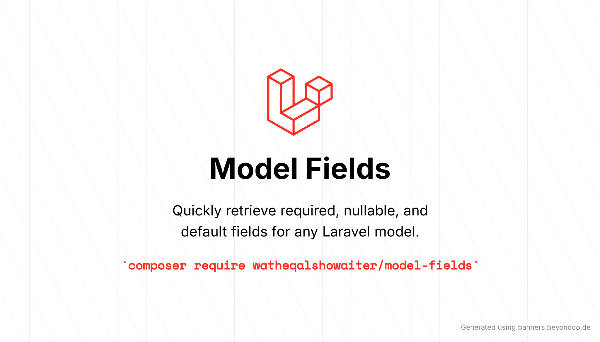

# Model Required Fields

<!-- shields -->
[![Required Laravel Version][ico-laravel]][link-packagist]
[![Required PHP Version][ico-php]][link-packagist]
[![Latest Version on Packagist][ico-version]][link-packagist]
![GitHub Tests For Laravel Versions Action Status][ico-tests-for-laravel-versions]
![GitHub Tests For Databases Action Status][ico-tests-for-databases]
![GitHub Code Style Action Status][ico-code-style]
[![Total Downloads][ico-downloads]][link-downloads]
![GitHub Stars][ico-github-stars]
[![StandWithPalestine][ico-palestine]][link-palestine]

[ico-laravel]: https://img.shields.io/badge/Laravel-%E2%89%A56.0-ff2d20?style=flat-square&logo=laravel
[ico-php]: https://img.shields.io/packagist/php-v/watheqalshowaiter/model-required-fields?color=%238892BF&style=flat-square&logo=php
[ico-version]: https://img.shields.io/packagist/v/watheqalshowaiter/model-required-fields.svg?style=flat-square
[ico-license]: https://img.shields.io/badge/license-MIT-brightgreen.svg?style=flat-square
[ico-downloads]: https://img.shields.io/packagist/dt/watheqalshowaiter/model-required-fields.svg?style=flat-square&color=%23007ec6
[ico-code-style]: https://img.shields.io/github/actions/workflow/status/watheqalshowaiter/model-required-fields/fix-php-code-style-issues.yml?branch=main&label=code%20style&style=flat-square
[ico-tests-for-laravel-versions]: https://img.shields.io/github/actions/workflow/status/watheqalshowaiter/model-required-fields/tests-for-laravel-versions.yml?branch=main&label=laravel%20versions%20tests&style=flat-square
[ico-tests-for-databases]: https://img.shields.io/github/actions/workflow/status/watheqalshowaiter/model-required-fields/tests-for-databases.yml?branch=main&label=databases%20tests&style=flat-square
[ico-github-stars]: https://img.shields.io/github/stars/watheqalshowaiter/model-required-fields?style=flat-square
[ico-palestine]: https://raw.githubusercontent.com/TheBSD/StandWithPalestine/main/badges/StandWithPalestine.svg

[link-packagist]: https://packagist.org/packages/watheqalshowaiter/model-required-fields
[link-downloads]: https://packagist.org/packages/watheqalshowaiter/model-required-fields/stats
[link-palestine]: https://github.com/TheBSD/StandWithPalestine/blob/main/docs/README.md
<!-- ./shields -->

Get the **required** model fields, excluding **primary keys**, **nullable** fields, and fields with **defaults**. In other words, get the **minimal required** fields necessary to create the model without causing a database error.

> [!Note]  
> This is the documentation for version 2, if you want the version 1 documentation go with [this link](./v1.documentation.md)

## Installation

You can install the package via Composer:

```sh
composer require watheqalshowaiter/model-required-fields --dev
```

We prefer `--dev` because you usually use it in development, not in production. If you have a use case that requires
using the package in production, then remove the --dev flag.

Optionally, if you want to publish the configuration to disable/enable model macros
```sh
php artisan vendor:publish --provider="WatheqAlshowaiter\ModelRequiredFields\ModelRequiredFieldsServiceProvider" --tag="config"
```

## Usage

We Assume that the `User` model has this schema as the default.

```php
Schema::create('users', function (Blueprint $table) {
    $table->id(); // primary key
    $table->string('name'); // required
    $table->string('email')->unique(); // required
    $table->timestamp('email_verified_at')->nullable(); // nullable
    $table->string('password'); // required
    $table->string('random_number'); // default (in model attributes)
    $table->rememberToken(); // nullable
    $table->timestamps(); // nullable
});
```

> [!IMPORTANT]  
> We have two ways:
> - Either use the `ModelFields` facade. (encouraged).
> - Or use the `RequiredFields` trait. (less encouraged and will be removed in the next major version).

We will explain the **trait way** in one example, and the other will be only using the **facade way** and all the methods
on both ways are the same.

```php
// Facade way
use WatheqAlshowaiter\ModelRequiredFields\ModelFields;
use App\Models\User;

ModelFields::model(User::class)->getRequiredFields(); // returns ['name', 'email', 'password']
```

```php
// Trait way
use WatheqAlshowaiter\ModelRequiredFields\RequiredFields;

class User extends Model
{
   use RequiredFields;

   protected $attributes = [
       'random_number' => '1234',
   ];
}
```

- Now use the trait as follows

```php
User::getRequiredFields(); // returns ['name', 'email', 'password']
```

That's it!

### Another Complex Table

Let's say the `Post` model has these fields

```php
Schema::create('posts', function (Blueprint $table) {
    $table->uuid('id')->primary(); // primary key
    $table->foreignId('user_id')->constrained(); // required
    $table->foreignId('category_id')->nullable(); // nullable
    $table->uuid(); // required (but will be changed later) 👇
    $table->ulid('ulid')->nullable(); // nullable (but will be changed later) 👇
    $table->boolean('active')->default(false); // default
    $table->string('title'); // required
    $table->json('description')->nullable(); // nullable (but will be changed later) 👇
    $table->string('slug')->nullable()->unique(); // nullable
    $table->timestamps(); // nullable
    $table->softDeletes(); // nullable
});

// later migration..
Schema::table('posts', function(Blueprint $table){
    $table->json('description')->nullable(false)->change(); // required
    $table->ulid('ulid')->nullable(false)->change(); // required
    $table->uuid()->nullable()->change(); // nullable
});
```

```php
ModelFields::model(Post::class)->getRequiredFields(); // returns ['user_id', 'ulid', 'title', 'description']
```

### And more

We have the flexibility to get required fields with nullables, defaults, primary keys, and a mix of them or return all
fields. You can use these methods with these results:

```php
// The default parameters only required fields
ModelFields::model(Post::class)
    ->getRequiredFields(
        $withNullables = false,
        $withDefaults = false,
        $withPrimaryKey = false
    );

// or
ModelFields::model(Post::class)->getRequiredFields();
// returns ['user_id', 'ulid', 'title', 'description']
```

```php
// get required fields with nullables
ModelFields::model(Post::class)
            ->getRequiredFields(
                $withNullables = true,
                $withDefaults = false,
                $withPrimaryKey = false        
            );

// or
ModelFields::model(Post::class)
            ->getRequiredFields(
                $withNullables = true    
            );

// or
ModelFields::model(Post::class)
            ->getRequiredFields(true);

// or
ModelFields::model(Post::class)
            ->getRequiredFieldsWithNullables();
// returns
// [
//     'user_id', 'category_id', 'uuid', 'ulid', 'title', 'description', 'slug',
//     'created_at', 'updated_at', 'deleted_at'
// ]
```

```php
// get required fields with defaults
ModelFields::model(Post::class)
            ->getRequiredFields(
                $withNullables = false,
                $withDefaults = true,
                $withPrimaryKey = false
        );

// or
ModelFields::model(Post::class)
            ->getRequiredFieldsWithDefaults();
// returns ['user_id', 'ulid', 'active', 'title', 'description']
```

```php
// get required fields with primary key
ModelFields::model(Post::class)
            ->getRequiredFields(
            $withNullables = false,
            $withDefaults = false,
            $withPrimaryKey = true
        );

// or
ModelFields::model(Post::class)
            ->getRequiredFieldsWithPrimaryKey();
// returns ['id', 'user_id', 'ulid', 'title', 'description']
```

```php
// get required fields with nullables and defaults
ModelFields::model(Post::class)
            ->getRequiredFields(
                $withNullables = true,
                $withDefaults = true,
                $withPrimaryKey = false
            );

// or
ModelFields::model(Post::class)
            ->getRequiredFieldsWithNullablesAndDefaults();
// returns
// [
//     'user_id', 'category_id', 'uuid', 'ulid', 'active', 'title', 'description', 'slug',
//     'created_at', 'updated_at', 'deleted_at'
// ]
```

```php
// get required fields with nullables and primary key
ModelFields::model(Post::class)
            ->getRequiredFields(
                $withNullables = true,
                $withDefaults = false,
                $withPrimaryKey = true
            );

// or
ModelFields::model(Post::class)
            ->getRequiredFieldsWithNullablesAndPrimaryKey();
// returns
// [
//     'id', 'user_id', 'category_id', 'uuid', 'ulid', 'title', 'description', 'slug',
//     'created_at', 'updated_at', 'deleted_at'
// ]
```

```php
// get required fields with defaults and primary key
ModelFields::model(Post::class)
            ->getRequiredFields(
            $withNullables = false,
            $withDefaults = true,
            $withPrimaryKey = true
        );

// or
ModelFields::model(Post::class)
          ->getRequiredFieldsWithDefaultsAndPrimaryKey();
// returns ['id', 'user_id', 'ulid', 'active', 'title', 'description']
```

```php
// get required fields with nullables, defaults and primary key
ModelFields::model(Post::class)
            ->getRequiredFields(
                $withNullables = true,
                $withDefaults = true,
                $withPrimaryKey = true
            );

// or
ModelFields::model(Post::class)
            ->getAllFields();
// returns
// [
//     'id', 'user_id', 'category_id', 'uuid', 'ulid', 'active', 'title', 'description',
//     'slug', 'created_at', 'updated_at', 'deleted_at'
// ]
```

## Why?

### The problem

I wanted to add tests to a legacy project that didn't have any. I wanted to add tests but couldn't find a factory, so I
tried building them. However, it was hard to figure out the required fields for testing the basic functionality since
some tables have too many fields.

### The Solution

To solve this, I created a simple trait (and a facade class) that retrieves the required fields easily. Later, I added support for older Laravel versions, as that was where most of the use cases occurred. Eventually, I extracted it into this package.

So Briefly, This package is useful if:

- you want to build factories or tests for projects you didn't start from scratch.
- you are working with a legacy project and don't want to be faced with SQL errors when creating tables.
- you have so many fields in your table and want to get the required fields fast.
- or any use case you find it useful.

## Features

✅ Supports Laravel versions: 12, 11, 10, 9, 8, 7, and 6.

✅ Supports PHP versions: 8.4, 8.3, 8.2, 8.1, 8.0, and 7.4.

✅ Supports SQL databases: SQLite, MySQL/MariaDB, PostgreSQL, and SQL Server.

✅ Fully automated tested with PHPUnit.

✅ Full GitHub Action CI pipeline to format code and test against all Laravel and PHP versions.

✅ Can return fields based on the dynamically added class strings (in the facade method).

## Testing

```sh
composer test
```

## Changelog

Please see [CHANGELOG](CHANGELOG.md) for more information on what has changed recently.

## Contributing

If you have any ideas or suggestions to improve it or fix bugs, your contribution is welcome.

I encourage you to look at [Issues](https://github.com/WatheqAlshowaiter/model-required-fields/issues) which are the
most important features that need to be added.

If you have something different, submit an issue first to discuss or report a bug, then do a pull request.

## Security Vulnerabilities

If you find any security vulnerabilities don't hesitate to contact me at `watheqalshowaiter[at]gmail[dot]com` to fix
them.

## Credits

- [Watheq Alshowaiter](https://github.com/WatheqAlshowaiter)

- [All Contributors](https://github.com/WatheqAlshowaiter/model-required-fields/graphs/contributors)

## License

The MIT License (MIT). Please see [License File](LICENSE.md) for more information.
